<a id="top"></a>

# 🌐 Projeto 18 – Web Project API Full

<!-- ⚙️ Tecnologias principais -->

[](https://aroundtheusa.sevencomets.com)

[](https://nodejs.org/pt)
[](https://developer.mozilla.org/docs/Web/JavaScript)

[](https://react.dev/)
[](https://vitejs.dev/)

[](https://expressjs.com/)
[](https://www.mongodb.com/)
[](https://JWT.io/)

[](https://restfulapi.net/)
[](https://pm2.keymetrics.io/docs/usage/pm2-doc-single-page/)

<!-- 🧰 Ferramentas e qualidade de código -->

[](https://www.npmjs.com/package/eslint-config-airbnb)
[](https://prettier.io/)

[](https://editorconfig.org/)

[](https://typicode.github.io/husky/)
[](https://github.com/okonet/lint-staged)

<!-- 💾 Infraestrutura e controle de versão -->

[](https://git-scm.com/)
[](https://github.com/VanessaYuriAB/web_project_api_full)

[](https://cloud.google.com/)
[](https://nginx.org/)

<!-- 🧪 Testes e segurança -->

[](https://www.ssllabs.com/ssltest/)
[-critical?style=flat>)]()

<!-- 🌍 Compatibilidade -->

[]()
[]()

<!-- 📜 Licença -->


---

## 📑 Índice

1. [Descrição 📖](#-1-descrição)
2. [Funcionalidades Principais ✨](#-2-funcionalidades-principais)
3. [Tecnologias Utilizadas 🛠️](#-3-tecnologias-utilizadas)
4. [Estrutura do Projeto 📂](#-4-estrutura-do-projeto)
5. [Como Executar Localmente ▶️](#-5-como-executar-localmente)
6. [Implantação 🌐](#-6-implantação)
7. [Checklist Atendido ✅](#-7-checklist-atendido)
8. [Capturas de Tela 📸](#-8-capturas-de-tela)
9. [Demonstração 🎥](#-9-demonstração)
10. [Melhorias 📈](#-10-melhorias)

---

<a id="-1-descrição"></a>

# 📖 1. Descrição

Este projeto é o sprint final do curso de Desenvolvimento Web Full-Stack da
Triple Ten. Consiste na criação de uma aplicação web completa, com **front-end
em React com Vite** e **back-end em Node.js com Express e Mongo DB** -
conectados via **API REST**.

Inclui autenticação, autorização, tratamento centralizado de erros e implantação
em um servidor na nuvem com `HTTPS`. Integra todas as funcionalidades
desenvolvidas nos sprints anteriores, juntando o
[projeto Express](https://github.com/VanessaYuriAB/web_project_around_express)
das **sprints 15 e 16 para o back-end** e o
[projeto Auth (React)](https://github.com/VanessaYuriAB/web_project_around_auth)
das **sprints 13, 14 e 17 para o front-end**.

➡️ **A aplicação permite:**

- Registro e login de usuários com autenticação via `JWT`.
- Edição de perfil e avatar.
- Criação, exclusão e curtidas em cartões.
- Proteção das rotas com middleware de autorização.
- Implantação completa com subdomínio, certificado SSL e integração entre
  front-end e back-end.

Segue uma **arquitetura `monorepo`**, com um **único diretório `.git`** na raiz
e **dois subdiretórios** principais: `backend/` e `frontend/`, cada um com seu
**próprio `package.json`** e **scripts independentes**.

E foi implantado em um **servidor Linux na Google Cloud**, utilizando
subdomínios configurados via `FreeDNS` e `Nginx` para roteamento.

[Voltar ao topo 🔝](#top)

---

<a id="-2-funcionalidades-principais"></a>

# ✨ 2. Funcionalidades Principais

## Registro e Login:

Usuários podem se cadastrar com e-mail e senha, e fazer login, obtendo um token
`JWT` válido por 7 dias. 🔐

## Proteção de Rotas:

Todas as rotas (exceto `/signin` e `/signup`) são protegidas por middleware que
valida o token `JWT`. 🛡️

📜 **Exemplo de código**

Middleware de autorização para rotas privadas (`middlewares/auth.js`):

```JavaScript
const jwt = require('jsonwebtoken');

const UnauthorizedError = require('../errors/UnauthorizedError');
const ConfigError = require('../errors/ConfigError');

module.exports = (req, res, next) => {
  const { authorization } = req.headers;

  const token = authorization.replace('Bearer ', '');

  let payload;

  if (process.env.NODE_ENV === 'production' && !process.env.JWT_SECRET) {
    throw new ConfigError('JWT_SECRET é obrigatório em produção!');
  }

  try {
    payload = jwt.verify(token, process.env.JWT_SECRET || 'dev-secret');
  } catch (err) {
    return next(
      new UnauthorizedError('Token inválido ou expirado, não autorizado'),
    );
  }

  req.user = payload;

  return next();
};
```

📌 _Validação de configuração para garantir que `JWT_SECRET` esteja definido em
produção, garantindo segurança._

📌 _Tratamento customizado de erros com classes personalizadas._

📌 _Separação de responsabilidades, a validação básica de dados é feita pelo
middleware `Celebrate` com `Joi`._

## Validação de Dados:

Uso dos pacotes `Celebrate` (`Joi`) e `Validator` para validar entradas. ✅

🧠 **Por que usar?**  
Garante que os dados enviados pelo cliente estejam no formato correto antes de
chegar à lógica da aplicação.

⚙️ **Como funciona?**  
`Celebrate` + `Joi` para validar corpo da requisição. E `Validator` para URLs
com regras mais estritas dos que as nativas do `Joi`.

📜 **Exemplo de código → Celebrate (Joi)**

Middleware de validação de dados de entrada para cadastro e login de usuários,
com `Celebrate` + `Joi` (`middlewares/validators/celebrateForSignUpAndIn.js`):

```JavaScript
const { celebrate, Joi } = require('celebrate');

const celebrateForSignUpAndIn = celebrate({
  body: Joi.object()
    .keys({
      email: Joi.string().required().email(),
      password: Joi.string()
        .required()
        .min(8)
        .pattern(/^(?=.*[a-z])(?=.*\d)[a-zA-Z\d]{8,}$/),
    })
    .unknown(true),
});

module.exports = celebrateForSignUpAndIn;
```

📌 _Validação dos campos de `email` e `senha`, e permissão para outros campos
não descritos no middleware._

📌 _Verificação de formato de senha com `regex` em `.pattern()`, exigindo que
contenha, no mínimo, 8 caracteres e, pelo menos, uma letra minúscula e um
dígito._

📜 **Exemplo de código → validator.isURL**

Middleware de validação personalizada para `Joi`, com o método `isURL` de
`Validator` (`middlewares/validators/validateURL.js`):

```JavaScript
const isURL = require('validator/lib/isURL');

const validateURL = (value, helpers) => {
  if (isURL(value, { protocols: ['http', 'https'], require_protocol: true })) {
    return value;
  }
  return helpers.error('string.uri');
};

module.exports = validateURL;
```

📌 _`string.uri` é o nome do validador padrão e o nome do código de erro que o
método nativo gera, portanto foi usado para retornar o mesmo tipo de validação
de erro._

📌 _O middleware é usado em conjunto com `Joi` via `.custom(validateURL)`, em
middlewares de validação `Celebrate` que possuem campos com **entradas no
formato url**._

## Banco de Dados:

🗄️ **Produção:** utiliza `MongoDB Atlas` (banco de dados em nuvem), garantindo
alta disponibilidade, escalabilidade e segurança.

🗄️ **Desenvolvimento:** utiliza `MongoDB Compass` para gerenciar a instância
local, permitindo testes e desenvolvimento offline.

💡 **Por que usar essa abordagem?**

- `Atlas` oferece backup automático e fácil integração com aplicações em nuvem.
- `Compass` facilita visualização e manipulação dos dados durante o
  desenvolvimento.

## Tratamento Centralizado de Erros:

Middleware dedicado para lidar com erros e retornar respostas padronizadas com
status adequados conforme classes personalizadas (400, 401, 403, 404, 409, 500).
⚠️

📜**Exemplo de código**

Middleware de tratamento centralizado de erros com classes personalizadas
(`middlewares/errorHandler.js`):

```JavaScript
app.use((err, req, res, next) => {
  if (err.name === 'CastError') {
    return res.status(400).send({ message: '_id inválido ou incompleto' });
  }

  if (err.name === 'ValidationError') {
    return res
      .status(400)
      .send({ message: 'Dado(s) inválido(s) ou inexistente(s)' });
  }

  if (err.name === 'ConfigError') {
    return res
      .status(500)
      .send({ message: `Erro de configuração do servidor: ${err.message}` });
  }

  const { statusCode = 500, message = 'Ocorreu um erro no servidor' } = err;

  return res.status(statusCode).send({ message });
});
```

📌 _Verificação de erros de configuração de variáveis de ambiente (em produção)
e erros de `Bad Request`._

📌 _Fallback genérico para qualquer outro erro, com status `500` e mensagem
padrão, evitando exposição de detalhes internos._

📌 _Respostas adequadas para requisições inválidas e padronização de formato
consistente: `{ message: ... }`._

## Logs:

Registro de solicitações e erros em arquivos separados (`request.log` e
`error.log`), utilizando os pacotes:

📝 `Winston` → para criação, gerenciamento e formatação dos logs.

📝 `Express-winston` → para integração com o `Express`, registrando
automaticamente requisições `HTTP` e erros.

🧠 **Por que usar?**

Garante rastreabilidade e facilita a análise de problemas em produção.

## Gerenciamento de Perfil:

Atualização de nome, descrição e avatar. 👤

## Gerenciamento de Cartões:

Adição, exclusão e curtidas em cartões, garantindo que usuários não possam
alterar dados de outros. 🖼️

## Front-end React com Vite:

🎨 Interface responsiva.

🎨 Pop-ups para edição de perfil e avatar, também adição, confirmação de
exclusão e visualização de fotos de cartões.

🎨 Rotas protegidas com `ProtectedRoute`.

## Implantação Completa:

API acessível via **subdomínio com `HTTPS`**, front-end integrado e `PM2` para
recuperação automática em caso de falha. 🌍

📦 **Arquitetura `Monorepo`:**

- Um único diretório `.git` na raiz do projeto.
- Dois diretórios principais:
  - `backend/` → código do servidor `Node.js` (`API REST`) com seu próprio
    `package.json`.
  - `frontend/` → código do cliente `React` com `Vite`, também com
    `package.json` próprio.
- Scripts independentes para desenvolvimento e build, mas versionados juntos
  para integração contínua.

⚙️ **Configuração de Acesso:**

- Subdomínio configurado via `FreeDNS`.
- Proxy reverso com `NGINX` para:
  - Servir front-end e back-end sob o mesmo domínio.
  - Gerenciar certificados SSL (`HTTPS`) com `Certbot`.
- Gerenciamento de processos com `PM2` para reinício automático em caso de falha
  no servidor (backend).

🧠 **Por que usar essa abordagem?**

- Simplifica a integração entre front-end e back-end.
- Garante alta disponibilidade e segurança.
- Facilita o ciclo de desenvolvimento e entrega de software (CI/CD).

📜 **Exemplo de código → NGINX**

Configuração do `NGINX` no **servidor** da nuvem de **deploy** da aplicação
(`/etc/nginx/sites-available/default`):

```nginx
# Bloco para a API
server {
    server_name api.aroundtheusa.sevencomets.com;

    location / {
        proxy_pass http://localhost:3000;
        proxy_http_version 1.1;
        proxy_set_header Upgrade $http_upgrade;
        proxy_set_header Connection 'upgrade';
        proxy_set_header Host $host;
        proxy_cache_bypass $http_upgrade;
    }

    listen 443 ssl;
    ssl_certificate /etc/letsencrypt/live/aroundtheusa.sevencomets.com/fullchain.pem;
    ssl_certificate_key /etc/letsencrypt/live/aroundtheusa.sevencomets.com/privkey.pem;
    include /etc/letsencrypt/options-ssl-nginx.conf;
    ssl_dhparam /etc/letsencrypt/ssl-dhparams.pem;
}

# Bloco para o front-end
server {
    server_name aroundtheusa.sevencomets.com www.aroundtheusa.sevencomets.com;

    root /var/www/web_project_api_full/frontend/dist;
    index index.html;

    include /etc/nginx/mime.types;
    default_type application/octet-stream;

    # Evitar que arquivos JS/CSS caiam no fallback
    location ~* \.(js|css|png|jpg|jpeg|gif|svg|ico)$ {
        try_files $uri =404;
    }

    # Fallback para SPA
    location / {
        try_files $uri $uri/ /index.html;
    }

    listen 443 ssl;
    ssl_certificate /etc/letsencrypt/live/aroundtheusa.sevencomets.com/fullchain.pem;
    ssl_certificate_key /etc/letsencrypt/live/aroundtheusa.sevencomets.com/privkey.pem;
    ssl_dhparam /etc/letsencrypt/ssl-dhparams.pem;
}

# Bloco do Certbot para redirecionamento HTTP → HTTPS
server {
    if ($host = www.aroundtheusa.sevencomets.com) {
        return 301 https://$host$request_uri;
    } # gerenciado por Certbot

    if ($host = aroundtheusa.sevencomets.com) {
        return 301 https://$host$request_uri;
    } # gerenciado por Certbot

    listen 80;
    server_name aroundtheusa.sevencomets.com www.aroundtheusa.sevencomets.com;
    return 404; # gerenciado por Certbot
}
```

📌 _Blocos:_

- _para **API**: responsável por direcionar requisições para o **backend**
  `Node.js` via proxy reverso._
- _para o **front-end**: serve os arquivos estáticos do `React` (`SPA`) e
  garante fallback para `index.html`._
- _do `Certbot`: redirecionamento `HTTP` → `HTTPS`, para garantir segurança._

📜 **Exemplo de código → PM2**

Gerenciamento de processos com `PM2`, configuração para iniciar e manter o
**backend ativo** no servidor de **deploy**:

```shell
# Instala PM2 globalmente
npm install -g pm2

# Inicia a API com nome amigável
pm2 start web_project_api_full/backend/app.js --name "backend-full"

# Configura restart automático no boot
pm2 startup
pm2 save

# Reinicia o processo manualmente
pm2 restart backend-full

# Verifica status do processo
pm2 status backend-full

# Verifica logs do processo
pm2 logs backend-full
```

📌 _A configuração do `PM2` garante que o **backend reinicie automaticamente em
caso de falha** e mantém o processo ativo após reinicialização do servidor._

💡 Use `ecosystem.config.js` para gerenciar múltiplos processos (apps):
backend + scripts de build do frontend.

[Voltar ao topo 🔝](#top)

---

<a id="-3-tecnologias-utilizadas"></a>

# 🛠️ 3. Tecnologias Utilizadas

**Back-end:**

- 🟢 `Node.js`
- ⚡ `Express.js`
- 🍃 `MongoDB` + `Mongoose`
- 🔐 `JWT` (Json Web Token)
- 🔒 `bcryptjs` para hash de senha
- ✅ `Celebrate` + `Joi` para validação
- 🔍 `Validator` para validação de e-mails e URLs
- 🛡️ `Helmet` para segurança `HTTP`
- 📏 `express-rate-limit` para limitar requisições (proteção contra ataques de
  força bruta)
- 📝 `Winston` para logs
- 📊 `express-winston` (logs avançados)
- 🌱 `dotenv` para variáveis de ambiente
- 🔄 `PM2` para gerenciamento de processos
- 🔗 `CORS` para habilitar solicitações entre subdomínios
- 🛠️ Classes de erros personalizadas para padronização de respostas e status
  `HTTP` (`UnauthorizedError`, `ForbiddenError`, `NotFoundError`,
  `ConflictError` e `ConfigError`)

**Front-end:**

- ⚛️ `React.js`
- 🌐 `React Router`
- ⚡ `Vite`
- 🔗 `Fetch API` para comunicação com o back-end

**Ferramentas de Qualidade de Código:**

- 🧹 `ESLint` (`Airbnb` base)
- 🎨 `Prettier`
- 🐶 `Husky` + `lint-staged` (pré-commit hooks)

**Implantação (infraestrutura):**

- ☁️ Servidor Linux (`Google Cloud`)
- 🗂️ `Git` para controle de versão
- 🍃 `MongoDB` instalado na VM
- 🔗 `Nginx` para proxy reverso
- 🔒 Certificado SSL (`HTTPS`)
- ⚙️ Variáveis de ambiente com `.env`

[Voltar ao topo 🔝](#top)

---

<a id="-4-estrutura-do-projeto"></a>

# 📂 4. Estrutura do Projeto

```
.git
backend/
  ├── controllers/
  ├── errors/
  ├── middlewares/
    ├── validators/
      ├── cards/
      ├── users/
  ├── models/
  ├── routes/
  ├── utils/
  ├── app.js
  ├── package.json
frontend/
  ├── blocks/
  ├── dist/
    ├── assets/
    ├── images/
  ├── public/
    ├── images/
  ├── src/
    ├── assets/
    ├── components/
      ├── Footer/
      ├── Header/
      ├── InfoTooltip/
      ├── Login/
      ├── Main/
        ├── components/
          ├── Card/
          ├── Popup/
            ├── components/
              ├── DeleteConfirmation/
              ├── EditAvatar/
              ├── EditProfile/
              ├── ImagePopup/
              ├── NewCard/
      ├── ProtectedRoute/
      ├── Register/
    ├── contexts/
    ├── hooks/
    ├── utils/
  ├── vendor/
    ├── fonts/
  ├── index.html
  ├── package.json
  ├── vite.config.js
README.md
```

[Voltar ao topo 🔝](#top)

---

<a id="-5-como-executar-localmente"></a>

# ▶️ 5. Como Executar Localmente

1. Clone o repositório:

```shell
git clone <URL_DO_REPOSITORIO>
```

2. Instale as dependências:

```shell
cd backend && npm install
cd ../frontend $$ npm install
```

3. Inicie o back-end:

```shell
npm run dev
```

4. Inicie o front-end:

```shell
npm run dev
```

[Voltar ao topo 🔝](#top)

---

<a id="-6-implantação"></a>

# 🌐 6. Implantação

- **Servidor:** Google Cloud
- **Subdomínio (front-end):**
  [`https://aroundtheusa.sevencomets.com`](https://www.aroundtheusa.sevencomets.com/)
- **Subdomínio (API):** `https://api.aroundtheusa.sevencomets.com`

📌 Os subdomínios foram configurados usando o serviço `FreeDNS` para apontar
para o **IP público do servidor**, com `Nginx` gerenciando o roteamento entre
front-end e back-end.

[Voltar ao topo 🔝](#top)

---

<a id="-7-checklist-atendido"></a>

# ✅ 7. Checklist Atendido

✔ Estrutura do projeto com `.editorconfig`, `.eslintrc`, `.gitignore`

✔ Código seguindo padrão Airbnb e boas práticas (camelCase, nomes descritivos)

✔ Rotas implementadas:

- Projeto 15: `/users`, `/cards`, `/users/:id`
- Projeto 16: CRUD completo para usuários e cartões
- Projeto 17: Front-end `React` com rotas protegidas e integração com API
- Projeto 18: Registro, login, `JWT`, middleware de autorização

✔ Registro e login com `JWT`

✔ Middleware de autorização

✔ Proteção das rotas

✔ Tratamento centralizado de erros

✔ Validação com `Celebrate` e `Validator`

✔ Logs de solicitações e erros

✔ Implantação com `HTTPS` e `PM2`

✔ Front-end integrado ao back-end

✔ Certificado SSL ativo

✔ Subdomínio registrado e configurado

[Voltar ao topo 🔝](#top)

---

<a id="-8-capturas-de-tela"></a>

## 📸 8. Capturas de Tela

### Autenticação

- 1️⃣ Tela de Cadastro


_Interface para criação de conta, com campos de e-mail e senha, validada pelo
middleware `Celebrate` + `Joi`._

- 2️⃣ Tela de Login

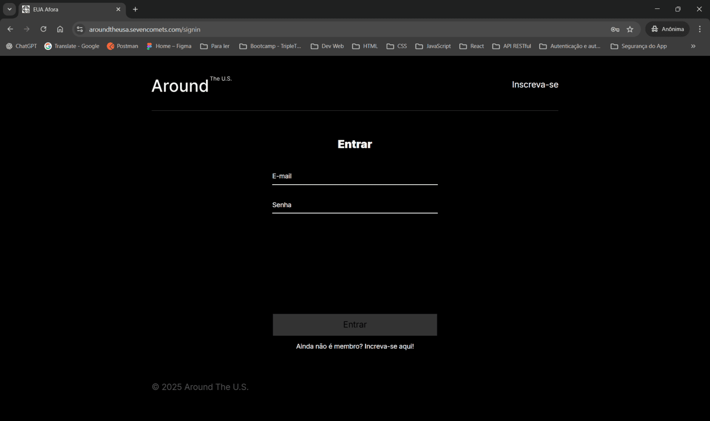

_Página de autenticação do usuário com proteção via `JWT`._

- 3️⃣ Tela de Login com DevTools


_Exibição do fluxo de autenticação e requisição à API no painel de rede._

### Integração com API (GET /users/me + GET /cards)

- 4️⃣ Fetch GET /users/me – Preview


_Visualização do objeto JSON retornado pela API._

- 5️⃣ Fetch GET /users/me – Response


_Resposta da API com dados do usuário autenticado._

- 6️⃣ Fetch GET /cards – Preview

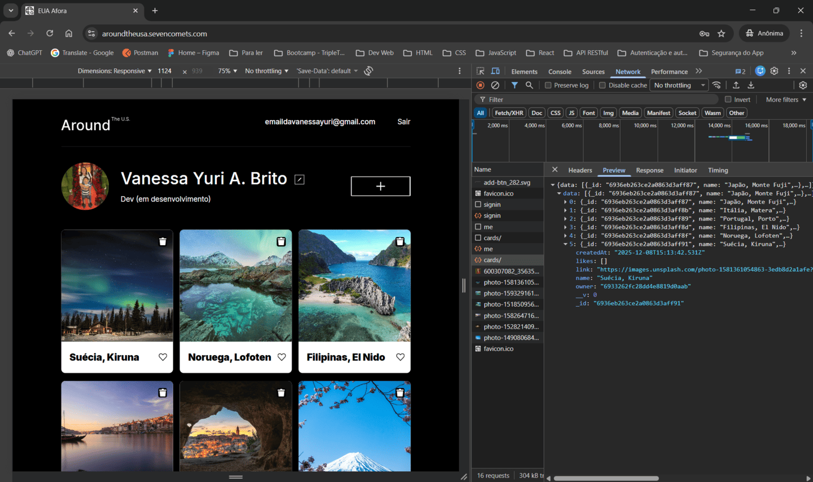

_Estrutura dos dados dos cartões no formato `JSON`._

- 7️⃣ Fetch GET /cards – Response


_Resposta da API com lista de cartões cadastrados._

- 8️⃣ Fetch GET /cards – Elements

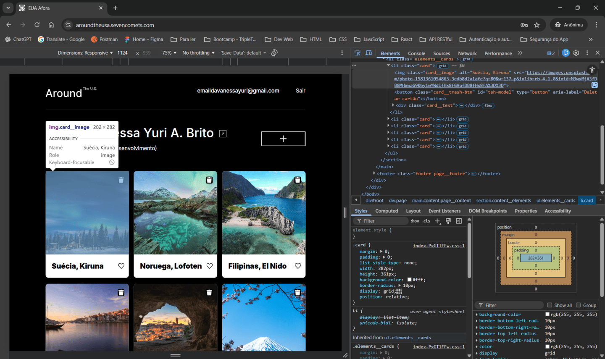

_Renderização dos cartões dinâmicos no `DOM`._

## Interface e Responsividade

- 9️⃣ Tela de Perfil


_Página principal exibindo avatar, nome e cards do usuário._

- 1️⃣0️⃣ Tela de Perfil em Tablet


_Layout responsivo adaptado para dispositivos médios._

- 1️⃣1️⃣ Tela de Perfil em Mobile

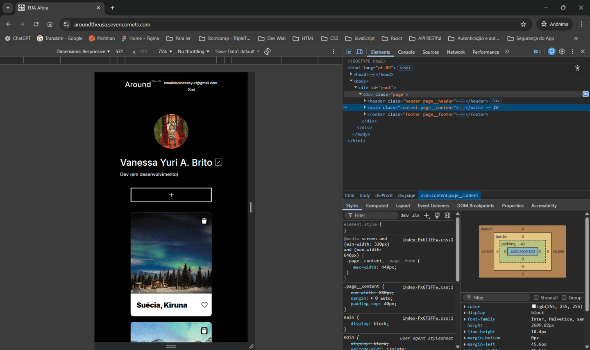

_Interface otimizada para smartphones._

## Pop-ups e Funcionalidades (Avatar, Perfil e Cartão)

- 1️⃣2️⃣ Popup de Edição de Avatar

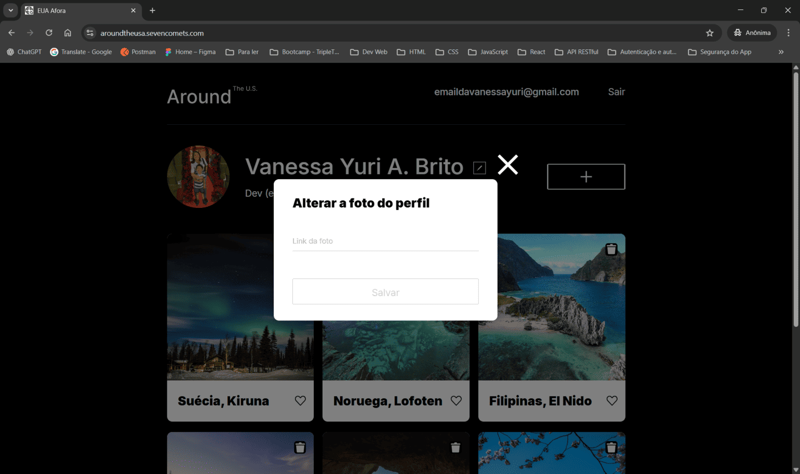

_Modal para atualização da imagem do perfil._

- 1️⃣3️⃣ Popup de Edição de Perfil

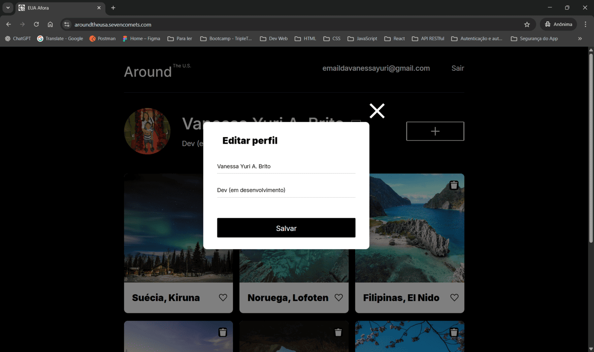

_Modal para alteração de nome e descrição do usuário._

- 1️⃣4️⃣ Popup de Novo Cartão

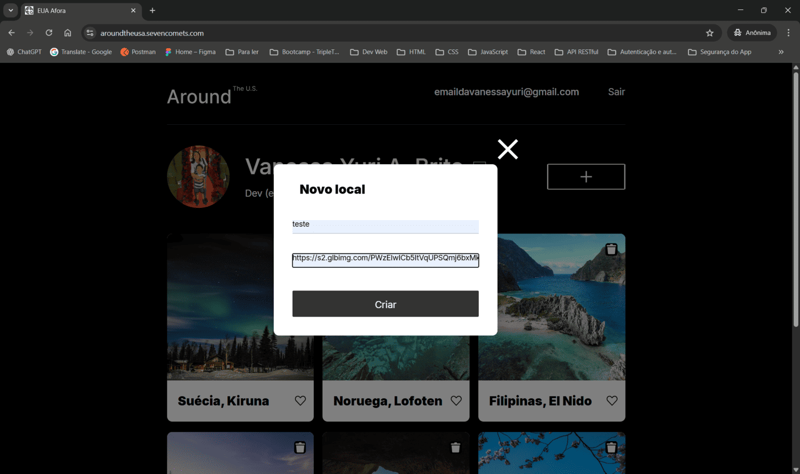

_Interface para criação de um novo card com título e link da imagem._

## Integração com API (POST /cards)

- 1️⃣5️⃣ Fetch POST /cards – Request


_Requisição para criação de novo card via API._

- 1️⃣6️⃣ Fetch POST /cards – Preflight


_Verificação `CORS` antes do envio da requisição._

- 1️⃣7️⃣ Fetch POST /cards – Created

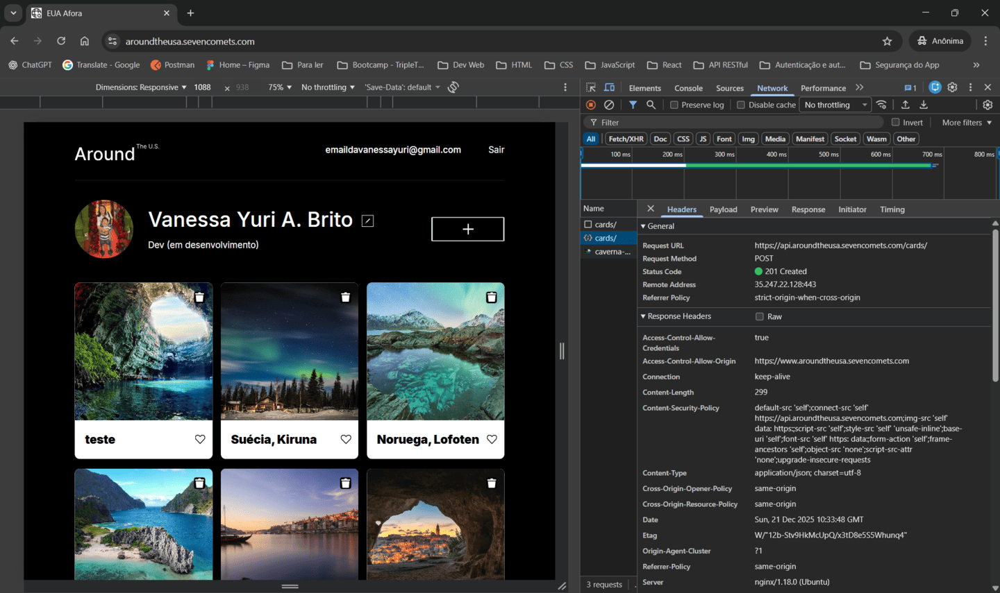

_Confirmação da criação do card no servidor._

- 1️⃣8️⃣ Fetch POST /cards – Payload


_Dados enviados na requisição para criação do card._

- 1️⃣9️⃣ Fetch POST /cards – Preview

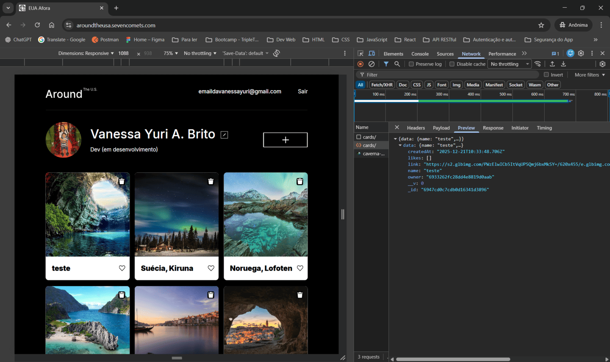

_Visualização do objeto `JSON` do novo card._

- 2️⃣0️⃣ Fetch POST /cards – Response

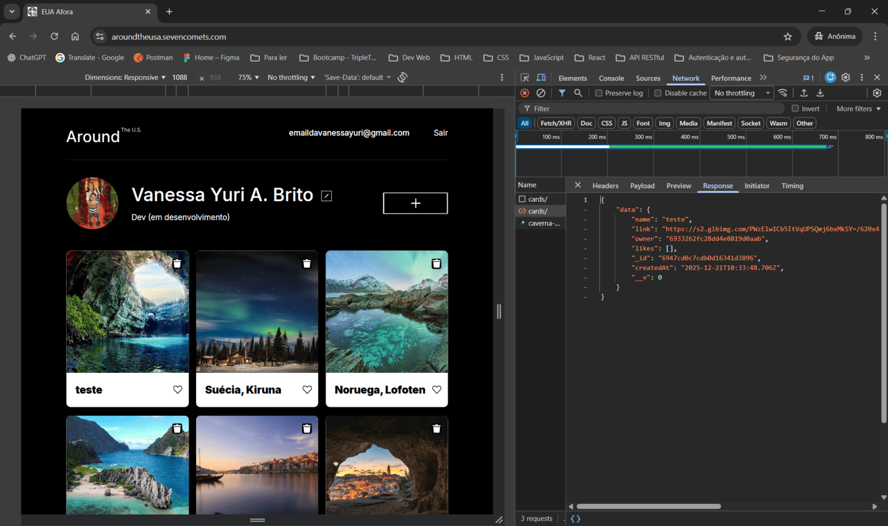

_Resposta da API confirmando sucesso da operação._

## Pop-ups e Funcionalidades (Imagem e Exclusão do Card)

- 2️⃣1️⃣ Popup de Imagem de Card


_Modal exibindo imagem ampliada do card selecionado._

- 2️⃣2️⃣ Popup de Confirmação de Exclusão

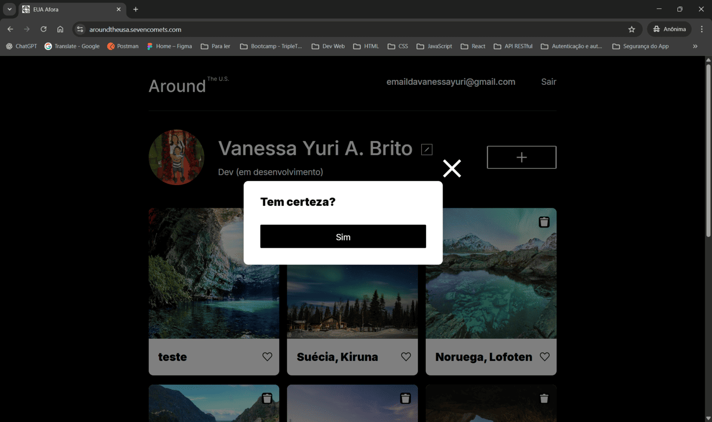

_Interface para confirmar remoção de um card._

[Voltar ao topo 🔝](#top)

---

<a id="-9-demonstração"></a>

# 🎥 9. Demonstração

👉 **URL do aplicativo:**
[`https://www.aroundtheusa.sevencomets.com`](https://www.aroundtheusa.sevencomets.com/)

👉 **Vídeo demonstrativo no Loom:**
[clique aqui](https://www.loom.com/share/24ff2fed3d2f4d3ca9c1f61e12fc68a4)

[Voltar ao topo 🔝](#top)

---

<a id="-10-melhorias"></a>

# 📈 10. Melhorias

## 🔧 Implementar **Testes Automatizados**

- **Ferramenta:** Adicionar `Jest` para testes unitários e de integração.
- **Abrangência dos testes:**
  - Funções e métodos isolados (unitários).
  - Conjuntos de testes para módulos críticos.
  - Testes de solicitações `HTTP` (rotas e middlewares).
  - Testes de operações no banco de dados (`CRUD`).
- **Integração contínua:**
  - Configurar scripts automatizados no `package.json` para rodar testes antes
    do deploy.
  - Adicionar hooks do `Husky` para executar testes em cada commit ou push,
    garantindo qualidade contínua.

## 🔧 **Substituir alert() por Feedback Visual** Consistente

- **Problema atual:** Ao atualizar imagens via link (avatar ou card), erros
  `403` ocorrem quando o link não possui mais a imagem, e atualmente é exibido
  um `alert()`, que quebra a experiência do usuário.
- **Melhoria proposta:**
  - Remover o uso de `alert()` para mensagens de erro.
  - Implementar componentes de feedback visual como tooltip ou toast para manter
    a interface consistente e agradável.
  - Exibir mensagens claras, como: "Não foi possível carregar a imagem.
    Verifique o link e tente novamente."

## 🔧 Gerenciar **Expiração do Token JWT no Front-end**

- **Problema atual:** Se o usuário não fizer logout e o token expirar, ele
  permanece no `localStorage` até que uma requisição falhe. Isso gera
  inconsistência, pois o usuário acredita estar logado, mas não está.
- **Melhoria proposta:**
  - Verificação proativa: Decodificar o `JWT` no front-end e checar o campo exp
    antes de usar.
  - Limpeza automática: Se `exp < Date.now() / 1000`, remover o token e
    redirecionar para a tela de login.
- **Exemplo simples:**

```JavaScript
import jwtDecode from 'jwt-decode';

const isTokenExpired = (token) => {
  try {
    const { exp } = jwtDecode(token);
    return Date.now() >= exp * 1000;
  } catch {
    return true; // token inválido
  }
};

// No useEffect:
const jwt = getToken();

if (!jwt || isTokenExpired(jwt)) {
  removeToken(setToken);
  setCheckingAuth(false);
  return;
}
```

## 🔧 **Deploy Automático do Backend com PM2**

- **Problema atual:** O deploy do backend é manual, exigindo acesso ao servidor
  para atualizar código e reiniciar processos, o que aumenta risco de erro e
  tempo de entrega.
- **Melhoria proposta:** Implementar script automatizado para atualizar o código
  do backend e reiniciar o processo com ``, garantindo zero downtime e maior
  eficiência.
- **Observação importante:** O procedimento não pode ser realizado via
  `git pull`, pois o projeto é um `monorepo` com `.git` na raiz e, no servidor,
  o front-end possui apenas a pasta `dist` (resultado do build).

## 🔧 **Padronizar Tratamento de Erros no Frontend** (Classe `Api` + `auth.js`)

- **Problema atual:** A `classe Api` já utiliza `try/catch` e lança erros via
  `_checkResponse`, mas o tratamento final é genérico (`console.error`) nos
  hooks dos componentes. Isso dificulta feedback claro para o usuário e
  padronização da lógica.
- **Melhoria proposta:**
  1. Criar `errorHandler.js` com funções:
  - `mapError(status)` → retorna mensagem amigável baseada no código `HTTP`.
  - `handleError(error)` → aplica lógica centralizada (ex.: log, exibição no
    UI).
  2. Refatorar `Classe Api`:
  - Integrar `mapError` e `handleError` no fluxo.
  - Remover lógica duplicada (`getErrorMessageByStatus` e `errorMessages`).
  3. Exemplo de integração com `auth.js`:
  - Substituir tratamento manual por chamada ao `handleError`.
  4. Sugestão para exibição no frontend:
  - Usar `Toast` (ex.: `react-toastify`) ou `Modal` para feedback visual
    consistente.
  - Mensagens claras como: "Erro ao atualizar avatar. Verifique o link e tente
    novamente."
- **Exemplo de errorHandler.js:**

```JavaScript
/ utils/errorHandler.js
export const mapError = (status) => {
  const messages = {
    400: 'Dados inválidos. Verifique os campos.',
    401: 'Sessão expirada. Faça login novamente.',
    403: 'Ação não permitida ou link inválido.',
    404: 'Recurso não encontrado.',
    500: 'Erro interno. Tente mais tarde.'
  };
  return messages[status] || 'Ocorreu um erro inesperado.';
};

export const handleError = (error) => {
  const status = error?.status || 500;
  const message = mapError(status);
  console.error(`[API ERROR] ${message}`, error);
  return message;
};
```

- **Refatorando Classe Api:**

```JavaScript
import { handleError } from '../utils/errorHandler';

class Api {
  constructor(baseUrl, headers) {
    this._baseUrl = baseUrl;
    this._headers = headers;
  }

  async _request(url, options) {
    try {
      const res = await fetch(`${this._baseUrl}${url}`, options);
      if (!res.ok) {
        throw { status: res.status };
      }
      return res.json();
    } catch (error) {
      throw handleError(error);
    }
  }

  getUserInfo() {
    return this._request('/users/me', { headers: this._headers });
  }

  // outros métodos...
}
```

- **Exibição no Frontend (Toast):**

```JavaScript
import { toast } from 'react-toastify';

const handleApiError = (errorMessage) => {
  toast.error(errorMessage, {
    position: 'top-right',
    autoClose: 5000,
    theme: 'colored'
  });
};
```

## 🔧 Estrutura do **README** e Organização da Documentação

- Manter o `README` principal conciso, destacando informações essenciais como
  tecnologias utilizadas e instruções de instalação.
- Criar uma pasta `/docs` para separar responsabilidades e detalhar aspectos
  específicos do projeto em arquivos dedicados, como:
  - `nginx.md`
  - `routes.md`
- No `README` principal, adicionar links para esses arquivos, garantindo uma
  navegação clara e separação de conceitos.

## 🔧 **Documentação** de Requisições **com Ferramentas Adequadas**

- Implementar a ferramenta `Swagger` para gerar documentação dinâmica e completa
  das requisições, respostas e erros esperados, evitando documentar muitas
  requisições diretamente no `README`, pois torna-se inviável em projetos
  grandes em que podem existir milhares de endpoints.
- Essa abordagem profissionaliza a documentação e facilita a manutenção à medida
  que o projeto cresce.

[Voltar ao topo 🔝](#top)

---
